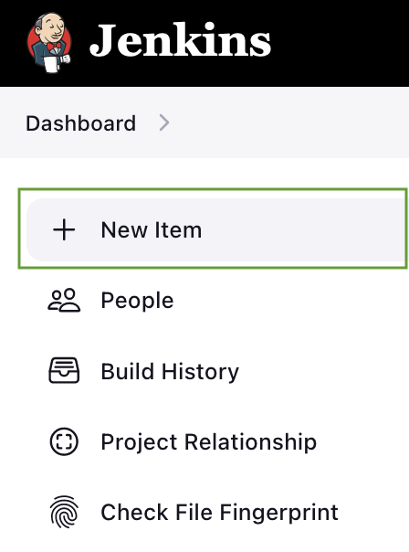
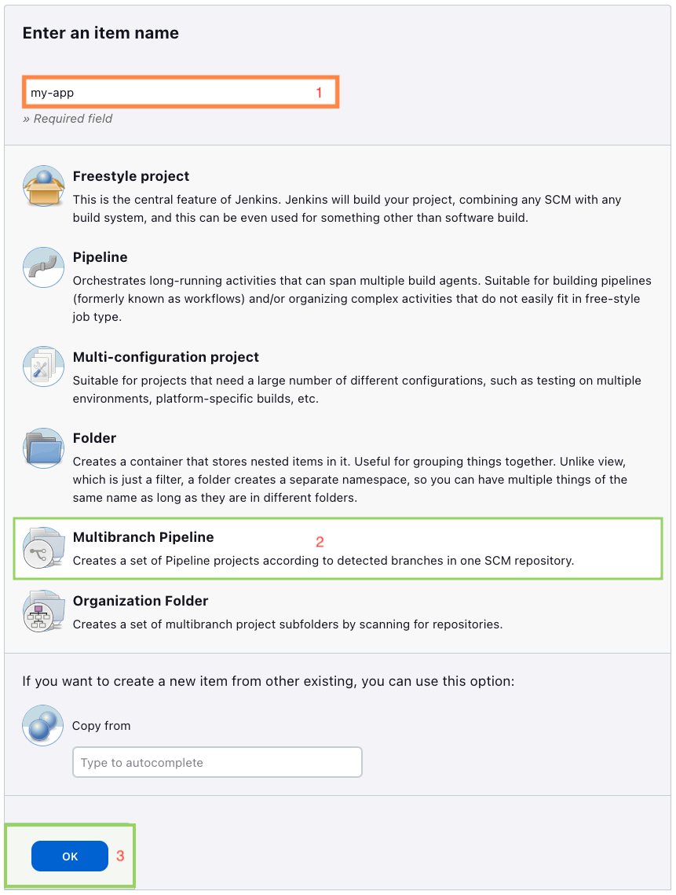
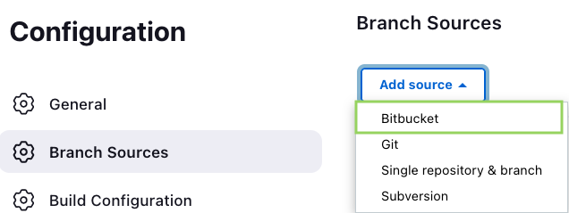
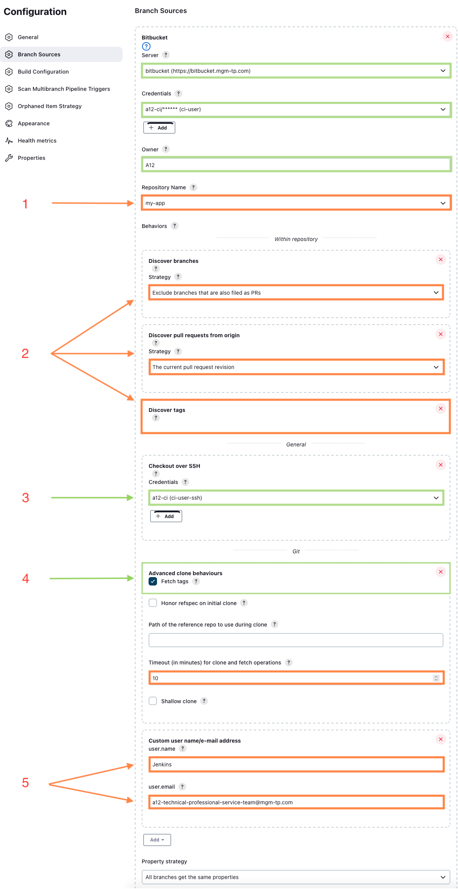
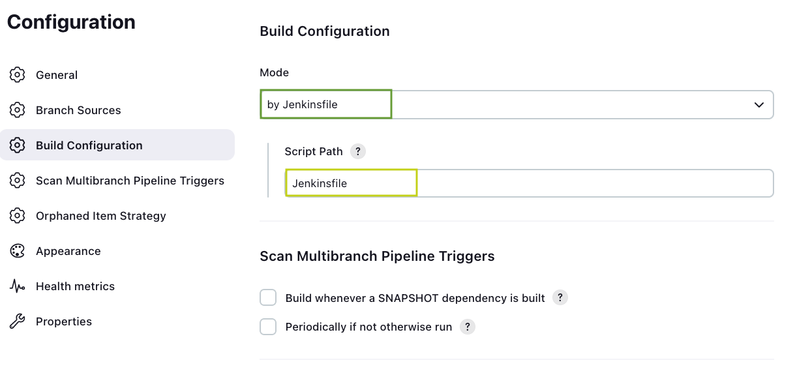
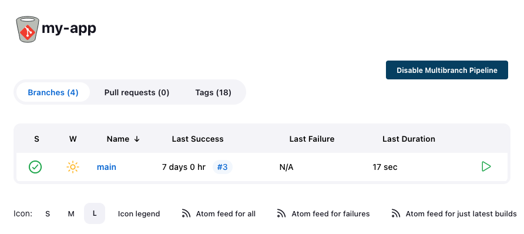

<!--- References --->
[getA12]: https://geta12.com/docs/#content:asciidoc,product:Overall,artifact:fullstack_project_template,scene:A12_fullstack_project_template
[geta12.com artifactory]: https://artifacts.geta12.com/
[mgm Wiki]: https://wiki.mgm-tp.com/confluence/display/A12/Tools+configuration
[mgm Artifactory]: https://artifacts.mgm-tp.com/artifactory/webapp/#/home
[JDK]: https://adoptopenjdk.net/
[Gradle]: https://docs.gradle.org/
[Gradle Wrapper]: https://docs.gradle.org/7.6.1/userguide/gradle_wrapper.html
[Docker]: https://hub.docker.com/
[Node]: https://nodejs.org/en/docs/
[Npm]: https://docs.npmjs.com/about-npm
[How to get started with Gradle]: https://wiki.mgm-tp.com/confluence/display/TECHHELP/How+to+get+started+with+Gradle
[How to configure your gradle settings with mgm's Artifactory]: https://wiki.mgm-tp.com/confluence/pages/viewpage.action?pageId=132744579
[How to configure your npm registry settings with mgm's Artifactory]: https://wiki.mgm-tp.com/confluence/pages/viewpage.action?pageId=131302935
[How to configure your docker registry settings with mgm's Artifactory]: https://wiki.mgm-tp.com/confluence/pages/viewpage.action?pageId=131302930
[Common Errors]: https://docs.npmjs.com/common-errors
[Troubleshooting]: https://docs.gradle.org/current/userguide/troubleshooting.html
[geta12.com]: https://geta12.com/docs/#product:overall,artifact:configuration_environment,content:asciidoc,scene:Environment_Setup
<!--- End of References --->

# A12 Full Stack Project Template

Use this template to quickstart your A12-based project. For more information about the A12 Full Stack Project Template and how to get started checkout [getA12].

> **Search for ``your-`` across this project (case-insensitive) to replace template values.**
>
> For instance, you should find "``training``" in several places. Replace "``your-project-name``" with the actual name of the project that you are creating.

> You will also find instances of "``your-db-name``", "``your-username``" and "``your-password``" in several places. Replace these with the actual name of the database, username and password that you will use in your project.

> By default, ``dockerUseCredentials`` is ``true`` in case you use credentials. Find and update the Docker registry for Keycloak in "``compose/.env``" with your Keycloak registry as well.
 
> Also, make sure to rename all packages starting with ``com.mgmtp.a12.template`` to a project-specific name.

## Prerequisites

The following tools are required in order to build this repository.

| Tool                 | Version | Note                                                       |
|----------------------|---------|------------------------------------------------------------|
| [JDK]                | `17`    |                                                            |
| [Gradle]<sup>1</sup> | `7.6.x` | Optional. Gradle Wrapper <sup>2</sup> can be used instead. |
| [Node]               | `18.x`  |                                                            |
| [Npm]<sup>1</sup>    | `8.x`   |                                                            |
| [Docker]<sup>1</sup> | `20.x`  |                                                            |

<sup>1</sup>) These tools have to be configured to use proper artifactory.
External partners need to use [geta12.com artifactory]. How to set all tools up can be found in [geta12.com]. mgm internal developers need to use [mgm artifactory] and find all needed information in [mgm Wiki].  
<sup>2</sup>) Gradle Wrapper:  
It is possible to use [Gradle wrapper] that allows you to skip the Gradle installation and uses required Gradle version. The setup according to note <sup>1</sup>) is still necessary.  
Usage is the **same as with all the gradle commands** in this document, just with using `.\gradlew.bat` (Windows) or `./gradlew` (Linux/MacOS) instead of `gradle`.

For example, getting a version information without the Gradle Wrapper:
```
gradle -v
```
getting a version information with the Gradle Wrapper on Windows systems:
```
.\gradlew.bat -v
```
getting a version information with the Gradle Wrapper on Linux or MacOS:
```
./gradlew -v
```

### Node & npm
To check that Node is installed just run `node -v` in the command line. This should return a version number, e.g. `v18.12.1`.
Similarly, you can see that npm is installed with `npm -v`, which should also print a version number like `8.19.2`.
Additionally, you can test your configuration with `npm config list`, which should print more details about your configuration.

### Gradle
To confirm that gradle is installed correctly run `gradle -v`. The result should look like:
```
------------------------------------------------------------
Gradle 7.5.1
------------------------------------------------------------

Build time:   2022-08-05 21:17:56 UTC
Revision:     d1daa0cbf1a0103000b71484e1dbfe096e095918

Kotlin:       1.6.21
Groovy:       3.0.10
Ant:          Apache Ant(TM) version 1.10.11 compiled on July 10 2021
JVM:          18.0.2.1 (Homebrew 18.0.2.1+0)
OS:           Mac OS X 12.5.1 aarch64
```

Lastly you can verify that gradle was configured correctly by running `gradle properties`. This should print an alphabetically sorted list of properties of your gradle configuration, which should include:
```
repository_password: <(hopefully encrypted) password>
repository_username: <username>
```

### Troubleshooting
If you run into any issues with the installation, you can find some common issues and solutions by referring to [Common Errors] for npm and [Troubleshooting] for gradle.

In case you get ```./gradlew: Permission denied``` error, please elevate the gradlew execution rights as follows:
```
chmod 755 gradlew
```

## Build

> ⚠️ Make sure you're in the **project root directory** and that all [prerequisites](#prerequisites) are fulfilled.

**Build the entire project:**

    gradle build

**Build only frontend:**

    gradle :client:build


### Build Docker Images

> **Important:** *For these commands to work, a) install Docker, b) enable "Expose daemon on tcp://localhost:2375 without TLS"
> in the settings, and c) make sure you can run Docker as non-admin user.*

> *If you still can't run Docker as non-admin user in Windows, go to Start Menu > "Edit Local Users and Groups"
> (Your user needs to have admin permissions) > Select "Groups" > "docker-users" > Add... > Below the "Enter the
object names to select" put the username you are trying to run docker commands and click in "Check names" > Ok > Ok*

> You can use the property 'dockerHost' inside `gradle.properties` file in order to use a docker running in another machine,
> this is very useful if you are running docker inside WSL for example, you can expose your docker daemon and use the IP
> address of your WSL in this property.

<a id="buildDockerImagesCommand"></a>
**Build all Docker images:**

    gradle buildImages

**Build only the Project Template Server image:**

    gradle :server:app:buildImages


## Run

By default, services are exposed or running on the following ports:

| Service                 | Port      | Note        |
|-------------------------|-----------|-------------|
| Frontend                | ``:8081`` |             |
| Project Template Server | ``:8082`` |             |
| Postgres                | ``:8083`` | docker only |
| Keycloak                | ``:8089`` | docker only |

### Run with Docker

> **Troubleshooting 1:** *If you have never logged in to the [mgm Artifactory] with Docker before,
> you have to run `docker login https://dockerregistry.mgm-tp.com` once and enter your Artifactory credentials.*

> **Troubleshooting 2:** *You must have [built all Docker images](#buildDockerImagesCommand) for the following to work.*

**Run all application components via Docker:**

    gradle composeUp

This starts up all components (Server, Frontend, Database, Keycloak). See [how to access the application](#using-the-application) next.

**Stop the docker containers run this way:**

    gradle composeDown

---

**Run only server-side components via Docker (for frontend developers):**

    gradle noClientComposeUp

**Stop the docker containers run this way:**

    gradle noClientComposeDown

---

**Run only Postgres via Docker:**

    gradle postgresComposeUp

**Stop the docker containers run this way:**

    gradle postgresComposeDown

---

**Run only a Keycloak via Docker:**

    gradle keycloakComposeUp

**Stop the docker containers run this way:**

    gradle keycloakComposeDown


### Run from IDE

**To run a backend service from your IDE:**

> Run the class annotated with ``@SpringBootApplication`` in the respective module:
> * ``ProjectTemplateServerApplication``
>
> This allows running each service in **debug** mode.

Alternatively, you could run each service via Gradle, e.g.:

    gradle :server:app:bootrun

### Set development Spring profile

There are several options to set your Spring profile to dev (the following two are recommended):

* Use every Gradle bootrun command with an argument

  ```
  gradle :server:app:bootrun --args='--spring.profiles.active=dev'
  ```

* Add `spring.profiles.active=dev` to your IDE's run configuration (or your env) in `server/app/src/main/resources/config/application.properties` file.
* In case the command is not working, Linux users can try this option:
  ```
  # first run
  export SPRING_PROFILES_ACTIVE=dev 
  
  # then
  gradle :server:app:bootrun 
  ```

### Start up standalone Keycloak

> **Note:** When the application is runnig via Docker, there is no need to run standalone Keycloak instance. See more in [Run with Docker](#run-with-docker).

To be able to login into the application a running **Keycloak instance** is required.

Other Project Template services are configured to expect Keycloak on the port 8089.
Project Template provides Keycloak via Docker compose with default configurations and realm (which is imported on startup). Preconfigured `keycloak` service can be started directly via docker compose or with the gradle alias task:

```
gradle keycloakComposeUp
```

## Frontend Development

> *For the following, make sure you're **inside a `client/` directory with a `package.json` file**
and that `npm` is set up to use the [mgm Artifactory] as described in the [prerequisites](#prerequisites).*

**Install all npm dependencies:**

    npm install

**Compile the npm project:**

    npm run compile

**Start the frontend application (using Webpack):**

    npm start

After that, changes you make to the frontend code will automatically be recompiled and reloaded in the browser.

**IDE**

Both VSCode and Intellij IDEA/WebStorm are supported

**Prettier and ESLint**

We are using Prettier and ESLint to enforce code convention (some but not all) and cleanness.

See the instruction below to set up **ESLint** in your favorite IDEs.

* Intellij IDEA/WebStorm: In Languages & Frameworks -> JavaScript -> Code Quality Tools -> ESLint, make sure Automatic ESLint configuration is checked.

* VSCode: ESLint is packaged together with VSCode so there is no additional config required.

See the instruction link below to set up **Prettier** in your favorite IDEs. We also recommend, to enable the format on save option in the ESLint settings to keep your files always formatted.
* Intellij IDEA/WebStorm: See [WebStorm Setup]
* VSCode: See [Editor Integration]

      npm run prettier:fix

   The above command can be executed for the client, so all files could be prettified by this as well.

**Client Chrome Extension** (Optional)

The Client Chrome Extension is an experimental development tool to inspect the current state of the application. With this tool you can do low level interactions with the application which are not possible via the UI. For example you can dispatch a commit or cancel action for an activity.

See how to install: [Client Chrome Extension]

**React and Redux Developer Tools**

As with the IDE, you can use any browser, but we use Chrome. Familiarize yourself with the React and Redux extensions. They are essential to inspect your application’s UI and backend state.

* React Extension: [React Developer Tools] 
* Redux Extension: [Redux DevTools]

## Using the Application

The frontend is running on http://localhost:8081.

There is currently one test user with credentials `admin`/`admin`.


## Working With This Project Template

### Frontend

You may implement your own A12 Client application here from scratch or adjust the example app.

> [Check out the Client documentation on getA12](https://geta12.com/docs/#product:client,artifact:client-dev-documentation-src,content:asciidoc,scene:Client,anchor:)

### Backend Services

All backend services are integrated into this project template based on their Spring Boot distribution artifacts.

These are the ``*-distribution`` dependencies you find in the ``build.gradle`` files of the backend services.

They allow setting up project-specific Spring Boot apps with custom extensions and configurations.

#### Extension

To register your own implementations or extensions, add your code under ``src/main/java`` as with any Spring Boot app.

You may need to adjust the ``@ComponentScan`` for Spring Boot to pick them up.

#### Configuration

To configure the services, modify the files ``src/main/resources/config/application-*.properties`` as with any Spring Boot app.

> [You may read more about Services configuration at getA12](https://geta12.com/docs/#content:asciidoc,product:Services,artifact:services-documentation-src,scene:Services,release:2021.02,anchor:services-configuration)

### Jenkins

Please note, that the ``buildEnvironment()`` function in the Jenkinsfile needs to be adjusted to fit your project configuration. Right now we are using the settings from `a12-jenkins`, because `a12-jenkins` is building our template.

Please check configuration at the beginning of Jenkinsfiles. Some values to be replaced:
* ``a12-ci`` -> your project ci user
* ``mgm-gradle-settings`` -> your project gradle config
* ``mgm-maven-settings`` -> your project maven config
* ``mgm-npmrc`` -> your project npm settings

### A12 Dependencies

In the `settings.gradle` it is possible to set the same version for different maven artifacts of the same A12 product. Keep in mind that this does not work for npm artifacts of A12 products, these need to be set in the `package.json` files.

Currently, not all products of A12 support maven BOMs. Therefore, we added a gradle extension (`buildSrc/src/main/groovy/com/mgmtp/a12/A12AlignmentRule.groovy`) in order to create [virtual BOMs](https://docs.gradle.org/7.5.1/userguide/dependency_version_alignment.html) of these products.

* `com.mgmtp.a12.base:base-virtual-bom`
* `com.mgmtp.a12.formengine:formengine-virtual-bom`

The usage can be seen in the `build.gradle` files as followed:

```
    // Align A12 Versions
    components.all(A12AlignmentRule)

    // Virtual BOMs
    implementation(platform(a12Libs.base.bom))

    // Native BOMs
    implementation(platform(a12Libs.kernel.bom))
    implementation(platform(a12Libs.uaa.bom))
    implementation(platform(a12Libs.dataservices.bom))
```

### Versioning

Version is defined in `gradle.properties` as A12 overall version + snapshot (eg. 2021.06-SNASPHOT).
Gradle build uses this version or if defined then version from `-PprojVersion` parameter.

#### Jenkins:
- MAIN -> build from main branch takes version from gradle and replace 'SNAPSHOT' with 'build<build_number>' and publish this version to  artifactory
- TAG -> takes the latest tag (no syntax check here) and build & publish with this version
- OTHER -> just run the build with gradle version without publish

### Hot module replacement (=HMR)
Webpack [Hot module replacement](https://v4.webpack.js.org/concepts/hot-module-replacement/) allows you to see changes you've done in your code immediately without needing to reload the page. In the fullstack project template HMR is implemented in `client/src/modules/index.ts` for modules in this folder. For files outside of the `modules/` folder (eg. `appsetup.ts`) livereload is applied.

#### HMR Configuration
If you want to add a new module or remove an old module, you can do it in the `client/src/modules/index.ts -> initializeHMR()` function. Webpack needs to know the context of the files therefore you have to declare your modules explicitly as a string.

```
/** Add new module example */

function initializeHMR() {
    ...
    module.hot.accept(["./person", "./myNewModule"] // register your "myNewModule" to webpack
    ...
    switch (moduleName) {
        case "person":
            hotModule = await import("./person");
            break;
        // Add your module
        case "myNewModule":
            hotModule = await import("./myNewModule");
            break;
    }
    ...
}
```

## Testing
### Unit tests with Jest (client)
[Jest](https://jestjs.io/) is used as the default unit testing framework for a couple of reasons.

* Beginner friendly - Writing test with jest is easy to learn.
* Zero config - Jest aims to work out of the box, config free, on most JavaScript projects.
* Snapshots - Make tests which keep track of large objects with ease. Snapshots live either alongside your tests, or embedded inline.
* Isolated - Tests are parallelized by running them in their own processes to maximize performance.
* Mocking - Jest provides mocking functionality out of the box.
* React - Jest includes react testing capabilities and is one of the recommended testing tools for react applications.
* Test coverage - No additional setup needed. Jest can collect code coverage information from entire projects, including untested files.

Tests are executed during the `gradle build`. You can also run them directly from the `client/` directory. Jest will automatically execute test for all `*.spec.ts(x)` and `*.test.ts(x)` files under the `client/src/` directory.

```bash
# Execute inside "client/" directory

# execute all tests
npm test

# watch mode
npm test -- --watch

# coverage mode
npm test -- --coverage
```

For testing fundamentals please refer to the [📖 Jest documentation](https://jestjs.io/docs/getting-started)

In Project template you can find this [example test](client/src/modules/spec.ts), which checks if modules are correctly registered after login and unregistered after logout.


## Keycloak
Project Template uses "A12Realm" for Keycloak default configuration. To manage Realm configuration, Users, Roles and more open "Administration Console" at http://localhost:8089 and login with admin/admin credentials (only in dev mode). Then select "A12Realm" where the realm can be modified according to your needs.

---

## Jenkins pipelines
__NOTE: Some instruction steps here are only applicable for project at mgm. If you are using it as a partner company, please use this README as a reference and process with the configuration at your organization.__

This repo is currently created for the purpose of providing a standard way for the customer project to build the A12 based application.

## How to use

__Before start using this project, you should remove the internal folder if you clone directly from Bitbucket since it is only there for A12 internal usage. Then these files `.npmignore` and `package.json` at root level shall be also removed.__

(This is one part of a complete pipeline template. For more information, please have a look also at [A12 Jenkins Deployment Pipelines](https://bitbucket.mgm-tp.com/projects/A12/repos/full-stack-project-deployment-template/browse/README.md).)

### Introduction

The A12 Build and Deployment Pipelines are a collection of pre-made Jenkins pipelines to help you build your application
and create deployments on the TPI dev cluster using the [Helm A12 stack charts](https://geta12.com/docs/#product:build_and_deployment,artifact:a12-stack,content:asciidoc,scene:Helm_A12_Stack).

There are pipelines available to create different environments on the cluster, as well as pipelines to deploy
application specific infrastructure. Pipelines for building and deploying the application itself to different environments are also included.

In this repository, we introduce to you the build application and deploy on-demand pipelines.

### Pipeline Overview

#### Build Pipeline

The build pipeline executes the build and check steps to ensure that the code adding to branch/pull request (PR) are runnable.
Docker images of your application should only be built after the previous steps and published on PR created or on `main` (and/or `release`, etc.) branches. Naming of the images are currently following the pattern:
- On PR and `main` branch: `x.y.z-build<BUILD-NUMBER>-SNAPSHOT`. For instance: `1.0.0-build00001-SNAPSHOT` (SNAPSHOT is used as postfix in this template for cleaning up purpose. Please update to the need of your project.)

**_Good to know:_** _SNAPSHOT images_ should be scheduled for cleanup as an agreement between project and artifactory management team to reduce redundant images.

For a successful build of the `main` branch, the deployment pipeline is triggered to deploy the application into `int` environment.

### Pipeline Preparation

#### Setup Credentials in Jenkins

For the build pipelines to work you will need the following credential:
* a CI user capable of accessing Artifactory

The CI user is usually created and assigned already in your Jenkins builder. You can find the correct username in Jenkins configuration and update in the Jenkins file.

#### Adapt Pipelines

You have to adapt the items in the Jenkinsfile marked with a `TODO` comment. These items include information specific to
your build environment, for example the references to your CI user, JDK version, Gradle version, etc.

#### Create job in Jenkins

__1. Access to your Jenkins builder__

Normally, the url should be `<training>-jenkins.pi.mgm-tp.com`. Please have a look at your project configuration on Wiki or ask TPI for the link to the Jenkins instance and your permission (editing privilege is required).

__2. Creating new Jenkins job__
- You can freely adjust the configuration as you need. Ideally the green textbox are the recommended based on A12 standard. And the orange are dependence on your project specification.

- Click **New Item** at the top left.

  

- Complete **New Item Wizard**
    1. Enter the item name.
    2. Choose *Multibranch Pipeline* as the type of item.
    
    3. Click OK at the end of the page to open the **Pipeline configuration** page.


- **Pipeline configuration page** contains serveral tabs: *General, Branch Sources, Build Configuration, Scan Mutibranch Pipline Triggers, Apepearance, etc.*. Below are the *recommended configuration* focus on **Branch Sources** and **Build Configuration**

- **Branch Sources Tab**

    - First of all, click **Add source** and select **Bitbucket** on the drop down menu.
    

    -  We will go througth 5 major sections (numbered from **1 to 5** in picture).
    1. **Bitbucket** have to be configured accordingly to your project configuration.
    2. **Discover branches** accordingly to your development process. Best practices: we usually discover all branches and PRs because for every PR needs at least one succeed build.
    3. **Checkout over SSH** is required for git pushing tag.
    4. **Advance clone behaviours** stick the check box `Fetch tags`
    5. **Custom user name/e-mail address** fill in values you wish to have in git commit message.
    

- **Build Configuration Tab**
    - Declare the path to Jenkinsfile
    

- Click on Save button when you are satisfied with your configuration. Your Jenkins job will be created shortly.

- Jenkins will do the first scanning from your repository and the result reflects your setting in `Branch Sources > Discover branches`.

- By default, there should be a branch `main` existing in the job. You can trigger the first build within the main branch and start building your first environment.
    

<!--- References--->
[WebStorm Setup]: https://prettier.io/docs/en/webstorm.html
[Editor Integration]: https://prettier.io/docs/en/editors.html
[Client Chrome Extension]: https://docs.geta12.com/docs/?release=2023.02#content:asciidoc,product:Overall,artifact:fullstack_project_template,scene:Qc5TNM,anchor:_dev_tool_chrome_extension
[React Developer Tools]: https://chrome.google.com/webstore/detail/react-developer-tools/fmkadmapgofadopljbjfkapdkoienihi?hl=en
[Redux DevTools]: https://chrome.google.com/webstore/detail/redux-devtools/lmhkpmbekcpmknklioeibfkpmmfibljd